# Exploratory data analysis of movie data.
* [Blog Link](https://medium.com/@saifkasmani84/creating-a-new-movie-studio-exploratory-data-analysis-of-movie-data-eafbc00a5d30)
* [Video Recording](https://youtu.be/dM9IPFhCnEM)
* [Presentation.pdf](./presentation.pptx.pdf)

# Table Of Contents
* [Purpose](#purpose)
* [Data Description](#data-description)
* [Data Cleaning](#data-cleaning)
* [Questions](#questions)
* [Wrap Up](#wrap-up)
* [Future Work](#future-work)

## Purpose
To analyze the given movie data and create a presentation that explores what type of films are currently doing the best at the box office. We must then translate those findings into actionable insights that the CEO of Microsoft can use when deciding what type of films they should be creating in the new movie studio.

## Data Description
We were given the following data to work with:
* bom.movie_gross.csv
* name.basics.csv
* rt.movie_info.tsv
* rt.reviews.tsv
* title.akas.csv
* title.basics.csv
* title.crew.csv
* title.principals.csv
* title.ratings.csv
* tmdb.movies.csv
* tn.movie_budgets.csv

These tables are taken from:
* [Box Office Mojo](https://www.boxofficemojo.com/)
* [IMDB](https://www.imdb.com/)
* [Rotten Tomatoes](https://www.rottentomatoes.com/)
* TheMovieDB.org

## Data Cleaning
All data was cleaned on [this notebook](./DataCleaning.ipynb).
 We created some [functions](./Data_Cleaning_Functions.py) which would help us achieve DRY style of coding.
In the Data Cleaning notebook we prepared our data to be exported for EDA. Removed unwanted columns and converted respective objects to date-time where needed. We had a goal to make one primary DataFrame with all the data we needed and formatted it as the desired data types needed for plotting and analysis. The file which is used as the primary csv file after cleaning is [group_data.csv](Data/group_data.csv)
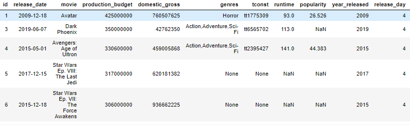

## Questions

 Question 1: What is the best day/month to release movies vs popularity/domestic gross?

[Q1Notebook](Questions/Question1.ipynb)
### EDA
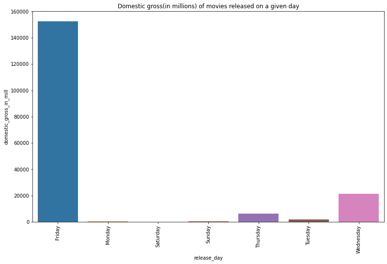
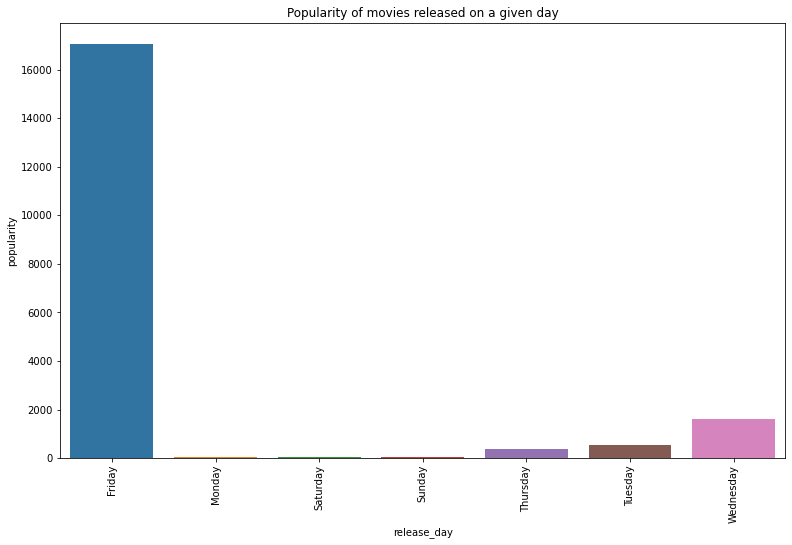
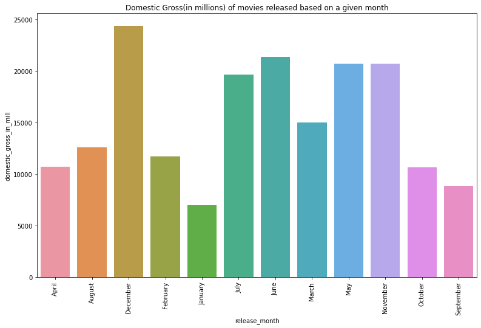
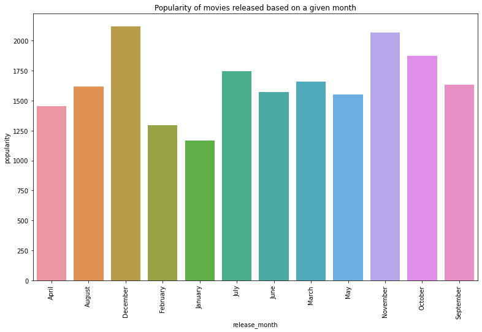

### Conclusion
**Friday** is the best day to release a movie, in terms of both popularity and also domestic gross. **December** is the best month to release a movie, in terms of both popularity and domestic gross

### Recommendation 
Try to release movies on a Friday so that more people will come and watch the movie which will drive up ticket sales as compared to other days. We have found out that December by far is the most popular and profitable month for movies to be released as compared to other months. So try to release movies in the October to December range of months.

 Question 2: What is the most successful genre?

[Q2Notebook](Questions/Question2.ipynb)
We were tasked with analysing what genre would be the most profitable for Mircosoft to consider as a category for them to enter the movie making industry. We decided to answer the following questions about movie genres to assist in finding what the best strategy for Mircosoft should be.

* What is the top overall movie genre?

* Is there a correlation between release month and higher profitability in that genre?

* Is there a correlation between production budget and net profits in the that genre?

### EDA

### Conclusion

* Out of the top 100 domestic gross movies over the past 30 years, the genre 'Action, Adventure, Sci-Fi' made up the largest successful genre group in that data sample.
* Our findings showed that releasing 'Action, Adventure, Sci-Fi' movies in late Spring/early-mid Summer, Spring Break week, during the holidays, and if it is a cultural movie, released during that culture's Heritage month, all proved to be the most profitable times of the year to release that genre.
* Sticking to a production budget of 200 million dollars while producing an 'Action, Adventure, Sci-Fi' movie has proven to be the key ingredient to high net profitability that can be forecasted to be between 200-500 million dollars.

### Recommendation

The final recommendation to Microsoft pertaining to what genre would be the most profitable for them to make movies in would be **'Action, Adventure, Sci-Fi'**.

 Question 3: Is there a relationship of run time of movies vs domestic gross, popularity and production budget? 

[Q3Notebook](Questions/Question3.ipynb)
Here we try to examine if there is a relationship between domestic gross/production budget vs runtime in minutes of a movie. We take the Top 100 highest grossing movies and the Bottom 100 lowest grossing movies and find out the mean runtime for them.

### EDA
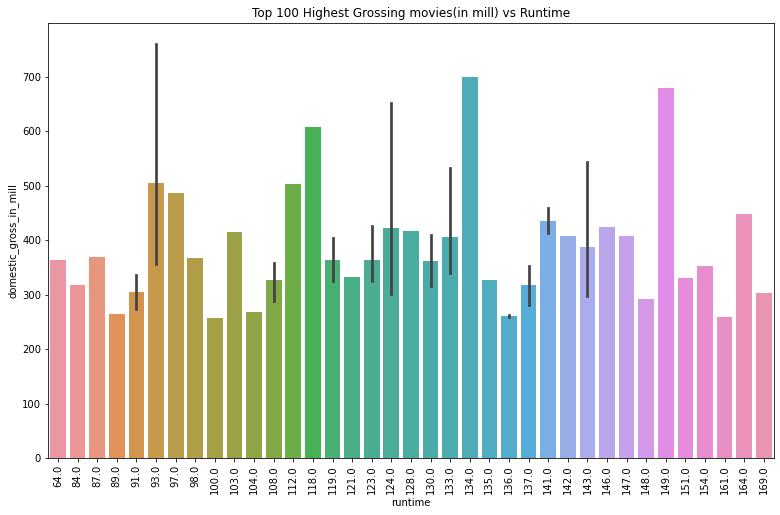
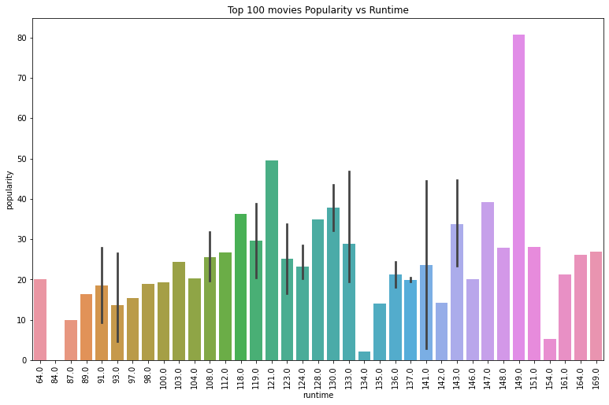

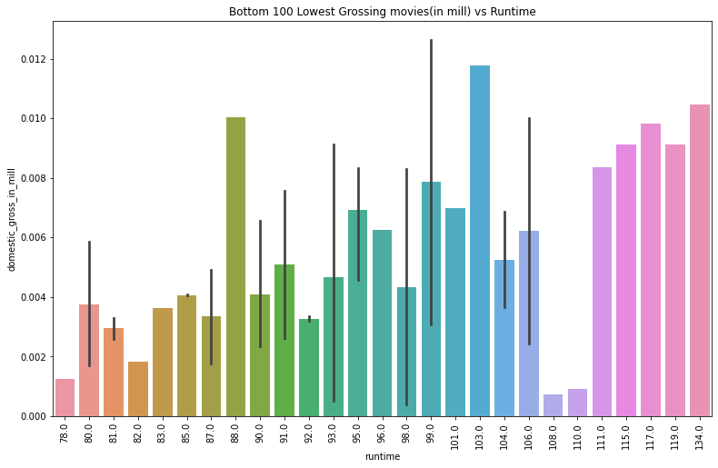

### Conclusion
It seems that the highest grossing movies average to be around **123 minutes** while the lowest grossing movies average around the **95 minutes** mark. The most popular movies in the top 100 movies have a runtime of **149 minutes**. If we take into consideration the most popular movies like Titanic, Avatar and all Marvel movies, this is what we would expect. As per our numbers, people normally like longer movies. Also as we can see in the heatmap that the correlation coefficient of runtime to production budget is positively correlated and is **0.31** which is moderately strong.

### Recommendation
Make movies averaging the **120-150 minutes** range and keep in mind that one of the factors that will make production budget increase is the increase in movie runtime.

 Question 4:  Can the film industry be a consistent profit center?

[Q4Notebook](Questions/Question4.ipynb)

Here we will evaluate questions such as:

* Are movies making more or less profit since 2000?
* Are movies getting more expensive to make since 2000?
* Does spending more money on production increase your chances of being profitable?
The intent of these questions are to provide an insight if the movie industry is thriving or failing. We want our clients to make the smartest decisions. We are looking to see if "an ounce of prevention equals a pound of cure". If we can inform our clients that entering the movie business will not only be a waste of time, but also a waste of resources not beginning down that path is the smartest choice to make.

### EDA
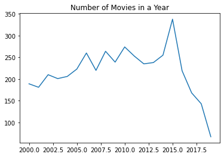
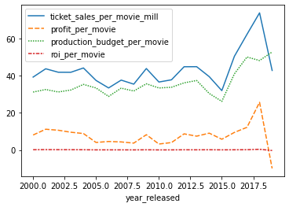
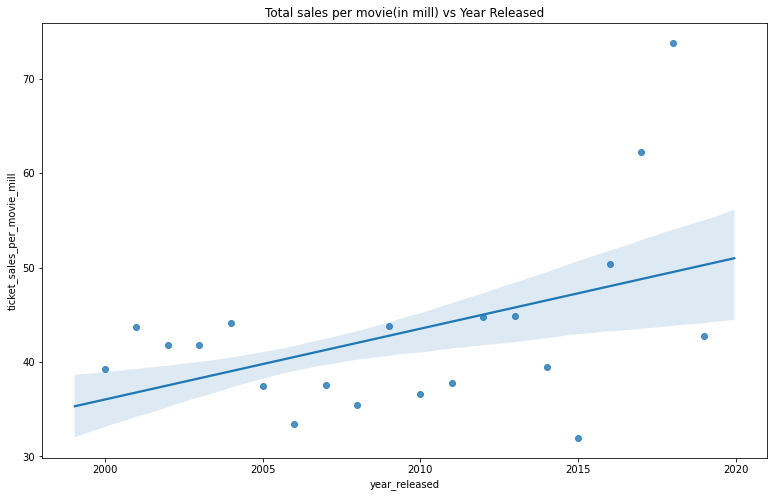
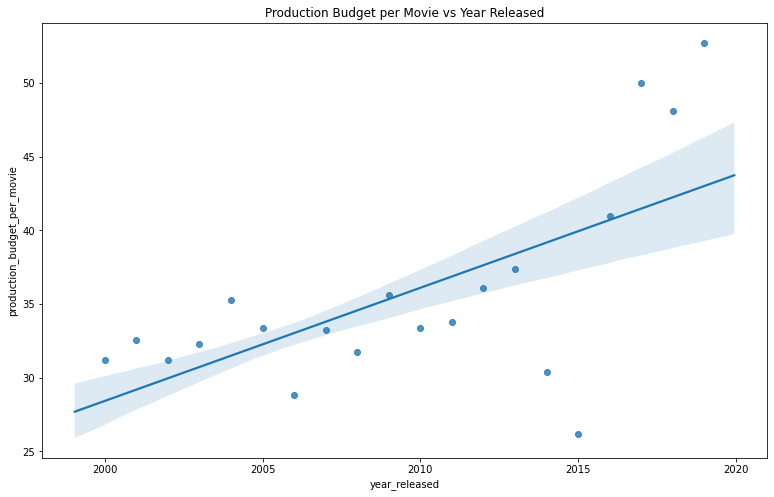
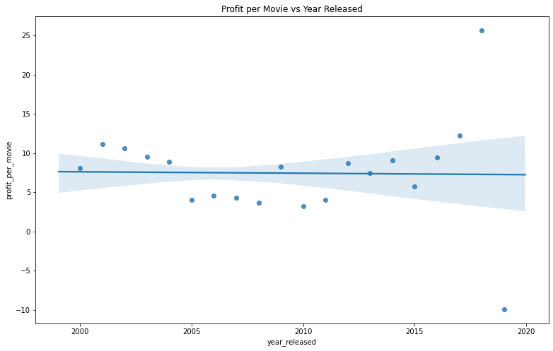
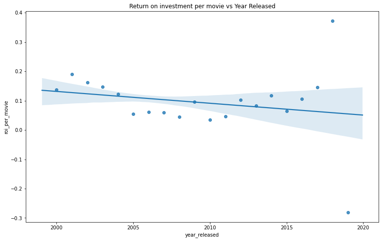

### Conclusion
**1. Are ticket sales growing since 2000?**
Figure 1.1 answers this question pretty plainly looking at the blue line representing ticket sales. Ticket sales shows an unicumbered picture of the demand for the movies created that year. From 2000 to 2015 ticket sales were not growing until a crazy spike going around 2018. Ticket sales after 2019 have declined dramatically after an impressive 2018 back to the same levels they were at the entire 2 decades we evaluated. There is no measurable growth in demand from 2000 to 2019.

**2. Are movies making more or less profit since 2000?**
This question is easily answerable looking at Figure 1.1, Figure 2.2, and Figure 3.0. Looking at Figure 2.2 we see the relationship of profit per movie over time with a line of best fit plotted showing the trend. The slope is flat to barely negative. Figure 3.0 shows the correlation coefficient between profit per movie and the year it was released is -0.17. This also shows there is a negligible negative correlation to the year it was released and the profit of the movie. This shows that movies are not becoming more profitable over time.

**3. Are movies getting more expensive to make since 2000?**
Similarly to question 2 lets look at Figure 2.1 and Figure 3.0. Figure 2.1 shows production budgets per movie over time. The line of best fit is showing a steep ascent which means that productions budgets have been growing as the years passed. Figure 3.0 shows the correlation coefficient between these two variables is 0.64. This is proof of a strong positive correlation of these values as the years go on the production budgets also increase. This shows that movies are becoming increasingly expensive to make over time.

**4. Does a larger production budget increase your chances of producing a profitable movie?**
Figure 3.0 measures the correlation between multiple variables including production budget and profit per movie and ROI. The values for production budget vs profit is 0.055 and production budget vs ROI is -0.14. This means that while production budget does have a little effect on ticket sales the increased cost in the budget is greater therefore hurting your return metrics. This shows that a larger production budget has no change to your profit and actually will hurt your return metrics.

### Recommendation
On this data I would not reccomend entering the movie industry as an unexperienced content creator. The majority of movies are not doing well and there is an extremely wide range in possible outcomes. That being said, I believe this data is leaving out a major part of the revenue stream for movies in the on demand market. If we had data on the income generated from on demand services such as Netflix it may shed a much more positive light on becoming a content creator. 

## Wrap up 
On the data that we were given to work with, i would not recommend entering the movie industry as an unexperienced content creator. The majority of movies are not doing well and there is an extremely wide range in possible outcomes. That being said, I believe this data is leaving out a major part of the revenue stream for movies in the on demand market. If we had data on the income generated from on demand services such as Netflix it may shed a much more positive light on becoming a content creator.

## Future Work
* Webscraping for the missing data.
* Use imdb API's to get the genre names for the genres they have in genre_id.
* Learn about recommender systems and how they can be implemented to increase revenue.

Fun Fact: With $631 million to date at the domestic box office, Marvel's “Black Panther” has become the highest-grossing superhero movie in the U.S.